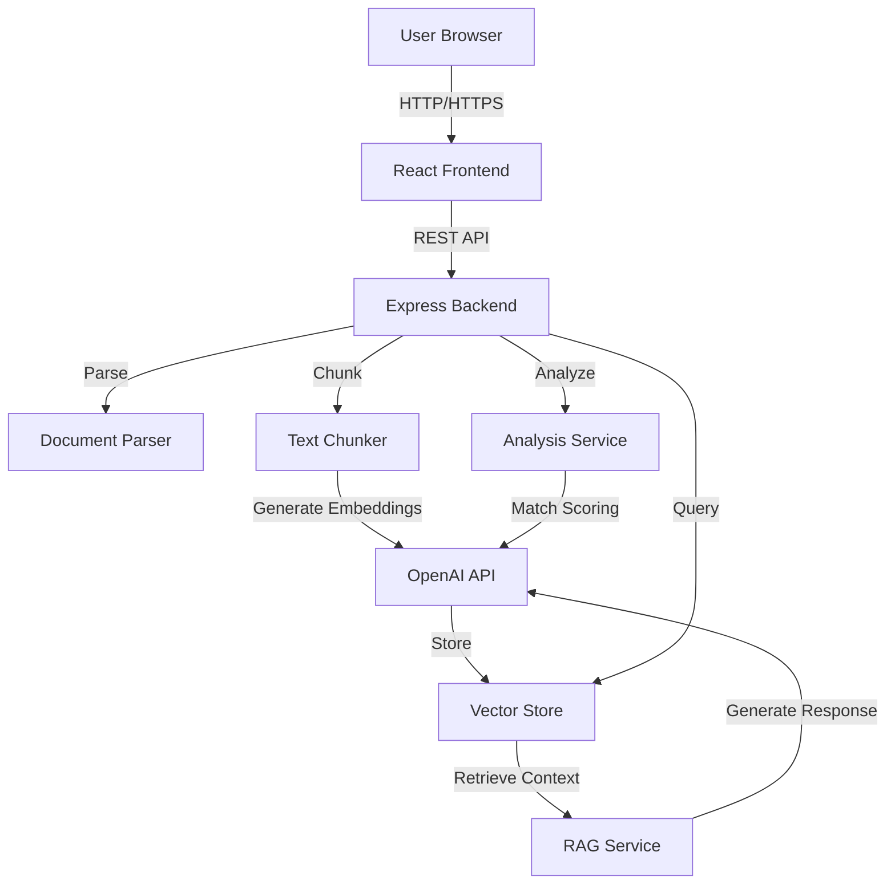
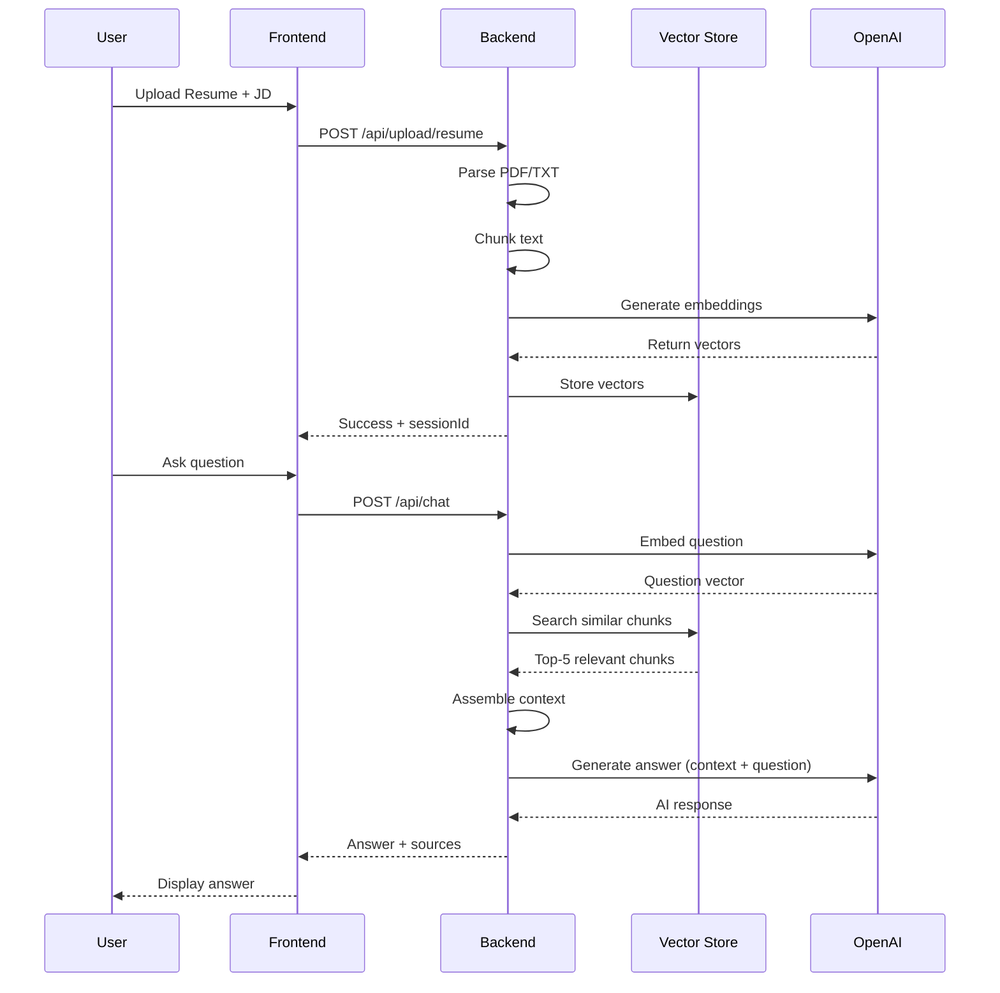

# Architecture Documentation

## System Overview

The AI Resume Screening Tool is a full-stack application that leverages Retrieval-Augmented Generation (RAG) to provide intelligent resume analysis and conversational Q&A capabilities.

## High-Level Architecture



## System Components

### Frontend Layer (React + TypeScript)

**Technology**: React 18, TypeScript, Vite, Axios

**Components**:
- `App.tsx`: Main application orchestrator managing state and workflow
- `FileUpload.tsx`: Drag-and-drop file upload with validation
- `MatchAnalysis.tsx`: Displays match score, strengths, gaps, and highlights
- `ChatInterface.tsx`: Conversational UI with message history

**State Management**:
- Local React state (useState)
- Session ID tracking for backend correlation
- Upload → Analyzing → Results state machine

**Communication**:
- REST API calls via Axios
- Proxy to backend during development (Vite)
- Error handling and user feedback

### Backend Layer (Node.js + Express + TypeScript)

**Technology**: Node.js 18+, Express.js, TypeScript

**Core Services**:

#### 1. Document Parser (`documentParser.ts`)
- **Purpose**: Extract text from PDF and TXT files
- **Dependencies**: pdf-parse, fs
- **Features**:
  - File validation (type, size)
  - Text extraction and cleaning
  - Word count calculation
- **Output**: Parsed document object with clean text

#### 2. Text Chunker (`textChunker.ts`)
- **Purpose**: Split documents into semantic chunks for embedding
- **Strategy**:
  - Detect resume sections (Summary, Experience, Education, Skills)
  - Chunk by section with configurable size (default 800 words)
  - Overlap between chunks (default 200 words) for context preservation
- **Metadata**: Section type, character offsets, chunk index
- **Output**: Array of text chunks with metadata

#### 3. Embedding Service (`embeddingService.ts`)
- **Purpose**: Generate vector embeddings using OpenAI
- **Model**: text-embedding-3-small (1536 dimensions)
- **Features**:
  - Single and batch embedding generation
  - Cosine similarity calculation
  - Error handling for API failures
- **Output**: Vector embeddings + original text

#### 4. Vector Store (`vectorStore.ts`)
- **Purpose**: In-memory vector database for semantic search
- **Implementation**:
  - Array-based storage with metadata
  - Cosine similarity search
  - Filtering by resume ID
  - CRUD operations (add, search, delete)
- **Production Alternative**: Can be replaced with Pinecone, Qdrant, or pgvector
- **Output**: Search results with similarity scores

#### 5. RAG Service (`ragService.ts`)
- **Purpose**: Core RAG implementation for question answering
- **Flow**:
  1. Convert question to embedding
  2. Search vector store for top-5 relevant chunks
  3. Assemble context from retrieved chunks
  4. Combine context + conversation history + question
  5. Send to OpenAI Chat API for response
- **Conversation Management**: Maintains chat history per session (last 10 messages)
- **Model**: GPT-4o-mini for cost-effective responses
- **Output**: AI answer + source chunks + conversation ID

#### 6. Analysis Service (`analysisService.ts`)
- **Purpose**: Resume vs Job Description analysis
- **Features**:
  - Match score calculation (0-100%)
  - Strengths identification
  - Gaps detection
  - Overall assessment generation
  - Resume info extraction (skills, experience, education)
- **Approach**: Structured prompts with JSON mode for reliable parsing
- **Output**: Structured analysis object

### API Layer

**Routes**:

1. **Upload Routes** (`uploadRoutes.ts`):
   - POST `/api/upload/resume` - Upload resume file
   - POST `/api/upload/job-description` - Upload JD file
   - POST `/api/upload/analyze` - Trigger analysis
   - DELETE `/api/upload/session/:id` - Clear session

2. **Chat Routes** (`chatRoutes.ts`):
   - POST `/api/chat` - Ask question (RAG)
   - GET `/api/chat/history/:id` - Get conversation history
   - DELETE `/api/chat/history/:id` - Clear conversation

**File Upload**:
- Uses Multer middleware
- Unique file naming (UUID)
- Size limit: 10MB
- Allowed types: .pdf, .txt

**Error Handling**:
- Centralized error handler middleware
- Custom AppError class
- Async handler wrapper
- User-friendly error messages

## RAG Implementation Deep Dive

### Why RAG?

Traditional approach (sending entire resume to LLM):
- **Problems**: Token limit constraints, high costs, potential hallucinations
- **Lacks**: Retrieval mechanism for relevant information

RAG approach (this implementation):
- **Benefits**: Efficient token usage, factual responses, scalable
- **Provides**: Semantic search, context-aware responses, source attribution

### RAG Flow Diagram



### Chunking Strategy

**Semantic Chunking**:
```typescript
Input: "SUMMARY\nSenior developer...\n\nEXPERIENCE\nTech Co..."

Output: [
  {
    text: "SUMMARY\nSenior developer...",
    metadata: { chunkType: "section", ... }
  },
  {
    text: "EXPERIENCE\nTech Co...",
    metadata: { chunkType: "section", ... }
  }
]
```

**Benefits**:
- Preserves context boundaries
- Better retrieval accuracy
- Logical information grouping

### Embedding & Retrieval

**Embedding Generation**:
- Model: `text-embedding-3-small`
- Dimensions: 1536
- Input: Text chunks (avg 500-1000 characters)
- Output: Float array [0.123, -0.456, ...]

**Similarity Search**:
```typescript
// Cosine similarity formula
similarity = dot(vecA, vecB) / (norm(vecA) * norm(vecB))

// Range: -1 to 1 (higher = more similar)
// Typical resume chunks: 0.6-0.9 for relevant matches
```

**Retrieval Strategy**:
- Top-k: 5 most similar chunks
- Score threshold: None (always return top-k)
- Re-ranking: By similarity score (descending)

### Context Assembly

**Context Structure**:
```
[Source 1] (Relevance: 89.2%)
Bachelor of Science in Computer Science
State University of New York at Buffalo
Graduated: May 2019

[Source 2] (Relevance: 85.7%)
TECHNICAL SKILLS
Programming Languages: JavaScript, TypeScript...
```

**Benefits**:
- LLM sees relevance scores
- Multiple sources for comprehensive answers
- Source attribution for verification

### Answer Generation

**System Prompt**:
```
You are an expert HR assistant helping recruiters evaluate candidates.

Your task is to answer questions about a candidate based ONLY on the 
information provided in their resume context below.

IMPORTANT RULES:
1. Base your answers ONLY on the provided resume context
2. If the information is not in the context, clearly state 
   "This information is not available in the resume"
3. Be specific and cite relevant details from the resume

RESUME CONTEXT:
[Retrieved chunks here]
```

**Advantages**:
- Grounded responses
- Reduces hallucinations
- Clear when information is unavailable

## Data Flow

### Upload & Analysis Flow

```
1. User selects resume file
   ↓
2. Frontend uploads to /api/upload/resume
   ↓
3. Backend parses document (PDF/TXT → text)
   ↓
4. User selects JD file
   ↓
5. Frontend uploads to /api/upload/job-description
   ↓
6. User clicks "Analyze"
   ↓
7. Backend chunks resume text
   ↓
8. Generate embeddings for chunks (OpenAI)
   ↓
9. Store embeddings in vector store
   ↓
10. Send resume + JD to Analysis Service
   ↓
11. LLM generates match score, strengths, gaps
   ↓
12. Return analysis to frontend
   ↓
13. Display results with animations
```

### Chat Flow

```
1. User types question
   ↓
2. Frontend sends to /api/chat
   ↓
3. Backend embeds question (OpenAI)
   ↓
4. Search vector store (cosine similarity)
   ↓
5. Retrieve top-5 relevant chunks
   ↓
6. Assemble context + conversation history
   ↓
7. Send to OpenAI Chat (GPT-4o-mini)
   ↓
8. Receive AI-generated answer
   ↓
9. Store message in conversation history
   ↓
10. Return answer + sources to frontend
   ↓
11. Display message in chat UI
```

## Database Design

### Vector Store Schema

```typescript
interface VectorDocument {
  id: string;                    // Unique identifier
  vector: number[];              // 1536-dimensional embedding
  text: string;                  // Original chunk text
  metadata: {
    source: string;              // "resume"
    chunkIndex: number;          // Position in document
    chunkType: string;           // "section", "content", etc.
    resumeId: string;            // Session ID for filtering
  };
}
```

### Session Management

In-memory storage (Map):
```typescript
// Uploaded files
Map<sessionId, {
  resume: { path, text },
  jobDescription: { path, text }
}>

// Conversations
Map<conversationId, ChatMessage[]>
```

**Production Consideration**: Replace with Redis or database for persistence

## Scalability Considerations

### Current Implementation (Demo/MVP)

- **Vector Store**: In-memory (single server)
- **Session Storage**: In-memory (single server)
- **File Storage**: Local filesystem
- **Limitations**: Single instance, no persistence

### Production Recommendations

1. **Vector Database**:
   - Pinecone: Managed, scalable, easy integration
   - Qdrant: Self-hosted, open-source
   - Weaviate: Feature-rich, GraphQL support
   - pgvector: PostgreSQL extension (if already using Postgres)

2. **Session Storage**:
   - Redis: Fast, in-memory, persistence options
   - Database: PostgreSQL, MongoDB for durability

3. **File Storage**:
   - AWS S3: Scalable object storage
   - Azure Blob Storage
   - Google Cloud Storage

4. **Caching**:
   - Cache embeddings to avoid regeneration
   - Cache LLM responses for common questions
   - Use Redis for session + cache

5. **Load Balancing**:
   - Multiple backend instances
   - Sticky sessions or shared session store
   - Vector DB handles distributed queries

## Security Architecture

### Input Validation
- File type checking (MIME + extension)
- File size limits (10MB)
- Sanitize file names
- Validate API inputs

### API Security
- CORS configured for specific origin
- Rate limiting (recommended for production)
- Input sanitization
- Error message sanitization

### Data Privacy
- Files stored temporarily
- Session cleanup on delete
- No data persistence (current)
- HTTPS in production (recommended)

### Environment Security
- API keys in environment variables
- .env files in .gitignore
- No secrets in code

## Performance Optimization

### Current Optimizations

1. **Batch Embedding**: Generate embeddings for all chunks in single API call
2. **Efficient Search**: In-memory vector search is fast (< 100ms)
3. **Conversation History Limit**: Keep last 10 messages to control context length
4. **Streaming**: Could add streaming responses for better UX

### Future Optimizations

1. **Caching**:
   - Cache document embeddings by file hash
   - Cache common questions/answers
   - Cache match analysis results

2. **Indexing**:
   - Use approximate nearest neighbor (ANN) algorithms
   - HNSW index in vector database

3. **Compression**:
   - Compress embeddings (quantization)
   - Reduce embedding dimensions if needed

4. **Parallel Processing**:
   - Parallel chunk processing
   - Concurrent embedding generation

## Monitoring & Observability

### Recommended Monitoring

1. **Application Metrics**:
   - Request latency (p50, p95, p99)
   - Error rates
   - Throughput (requests/sec)

2. **Business Metrics**:
   - Resumes analyzed per day
   - Average match scores
   - Chat questions per session
   - User engagement metrics

3. **Infrastructure Metrics**:
   - Memory usage (watch for leaks in in-memory store)
   - Vector store size
   - OpenAI API latency
   - File upload sizes

4. **Tools**:
   - DataDog, New Relic, or Prometheus
   - Custom logging (Winston, Pino)
   - Error tracking (Sentry)

## Technology Decisions

### Why TypeScript?
- Type safety reduces bugs
- Better IDE support
- Self-documenting code
- Required by assessment

### Why OpenAI?
- State-of-the-art embeddings
- Reliable Chat API
- Good documentation
- Fast response times

### Why In-Memory Vector Store?
- Simplicity for demo
- Fast development
- No external dependencies
- Easy to replace later

### Why React?
- Industry standard
- Great ecosystem
- Required by assessment
- Vite for fast development

### Why Express?
- Lightweight and flexible
- Large ecosystem
- Good TypeScript support
- Easy to understand

## Deployment Architecture (Recommended)

```
┌─────────────────┐
│   CloudFront    │  CDN for frontend
└────────┬────────┘
         │
┌────────▼────────┐
│   S3 Bucket     │  Static frontend hosting
└─────────────────┘

┌─────────────────┐
│  Load Balancer  │
└────────┬────────┘
         │
    ┌────▼─────┬────────┐
    │          │        │
┌───▼───┐ ┌───▼───┐ ┌──▼────┐
│ EC2/  │ │ EC2/  │ │ EC2/  │  Backend instances
│Fargate│ │Fargate│ │Fargate│
└───┬───┘ └───┬───┘ └──┬────┘
    │         │         │
    └─────┬───┴────┬────┘
          │        │
     ┌────▼────┐ ┌─▼──────┐
     │ Pinecone│ │ Redis  │
     │ Vector  │ │ Cache/ │
     │   DB    │ │Session │
     └─────────┘ └────────┘
          │
     ┌────▼────────┐
     │   OpenAI    │
     │   API       │
     └─────────────┘
```

## Conclusion

This architecture provides a solid foundation for an AI-powered resume screening tool with proper RAG implementation. The modular design allows for easy testing, maintenance, and future enhancements while maintaining clean separation of concerns across frontend, backend, and AI services.
